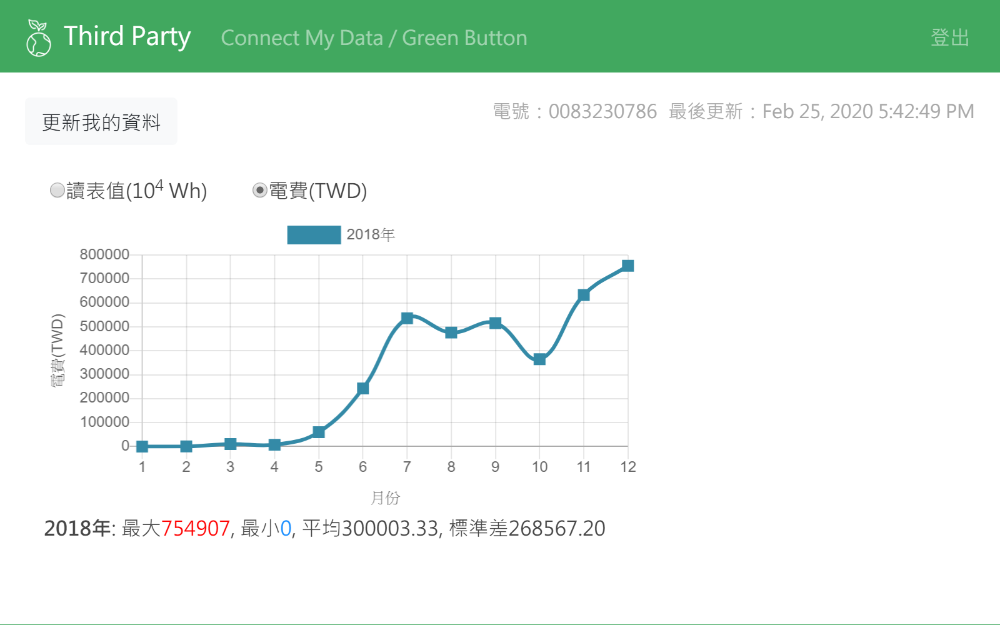
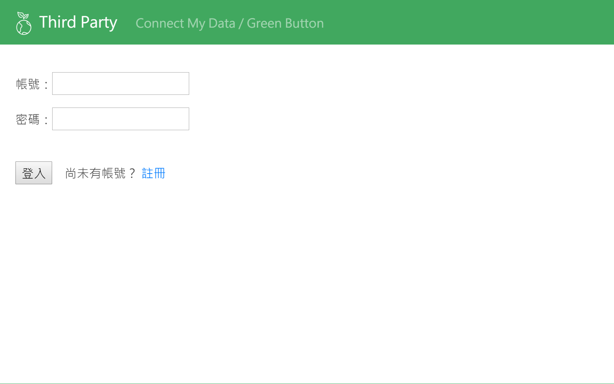
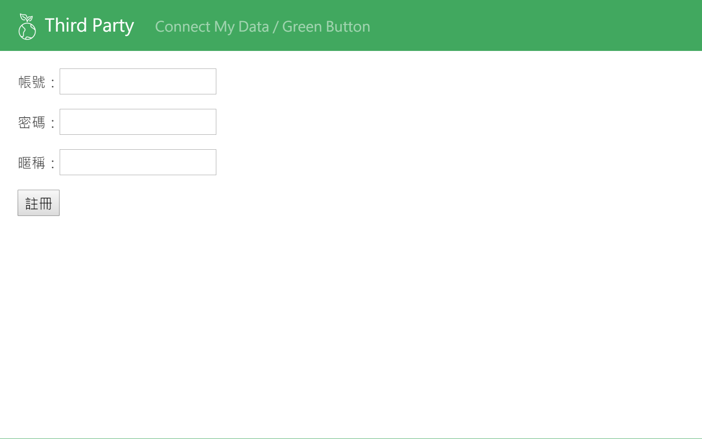
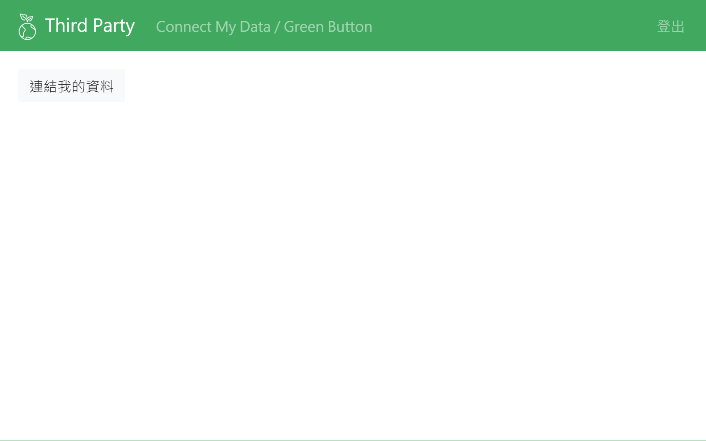
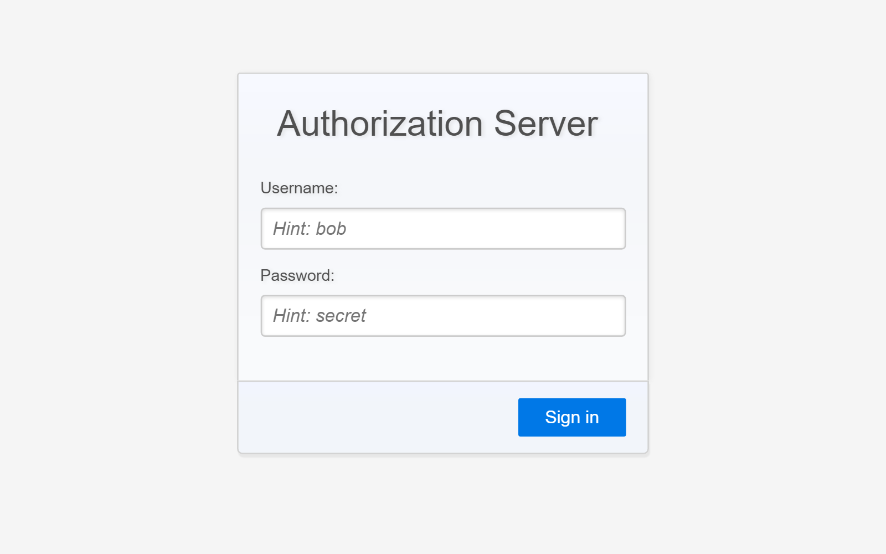
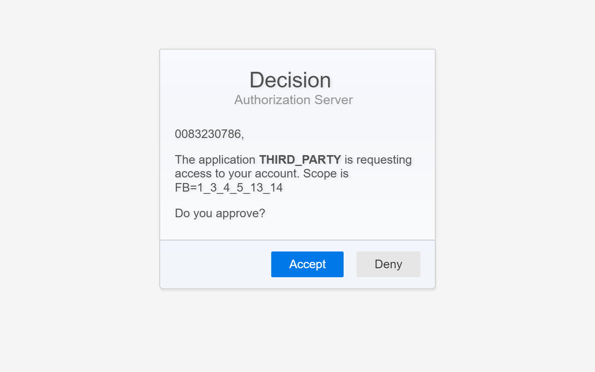
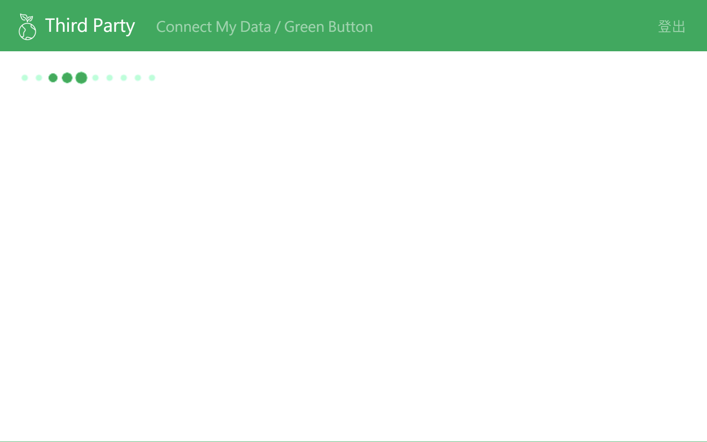
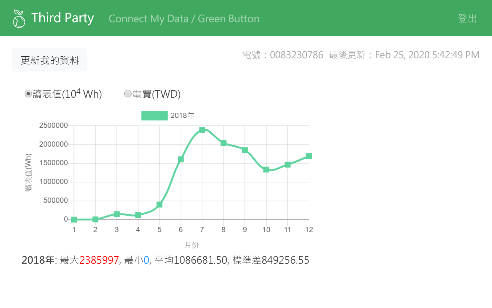
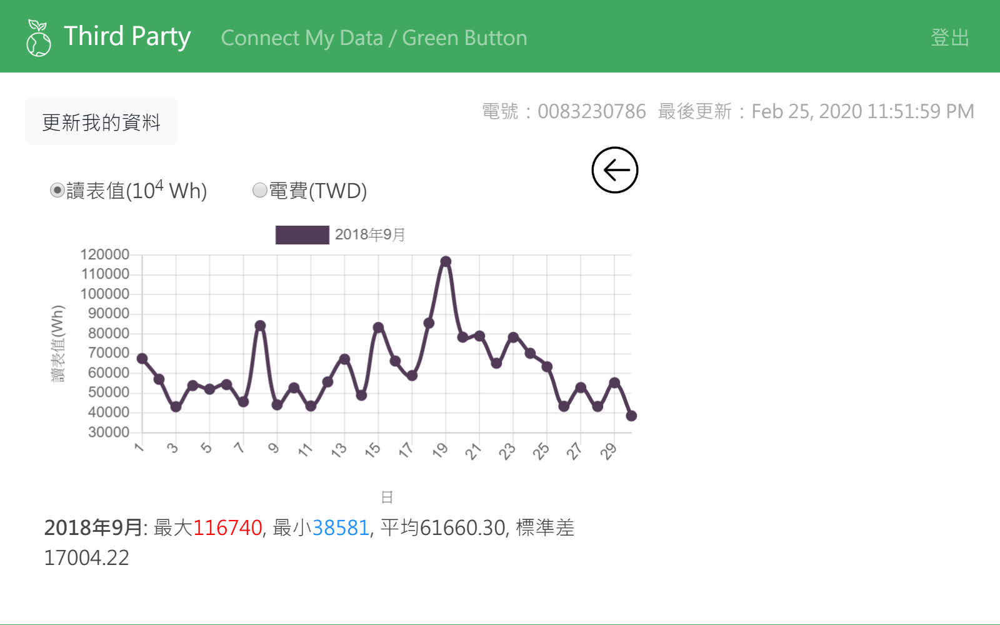
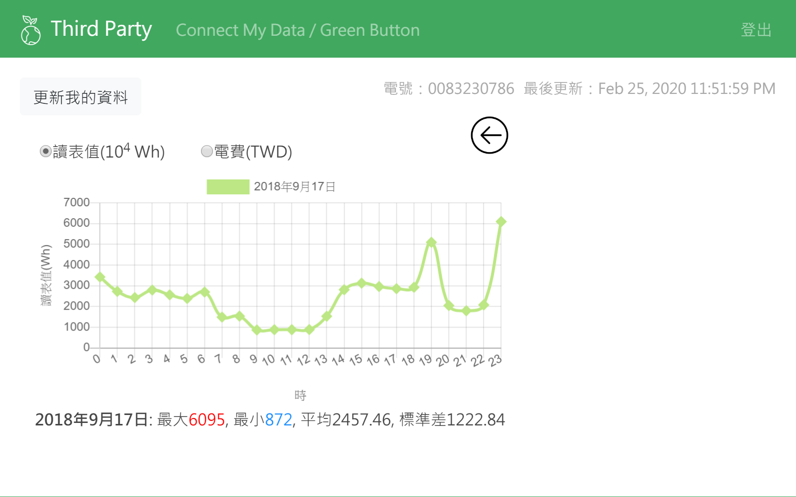

# ThirdPartyTW
實作 Green button CMD (connect my data) 獲取台灣電力公司資料於此應用 (第三方應用程式) 並圖表化顯示。



- ### 環境準備
	- [JDK 1.8](https://www.oracle.com/java/technologies/javase-jdk8-downloads.html "JDK 1.8")
	- [Maven 3](https://maven.apache.org "Maven 3")
	- [MySQL](https://www.mysql.com/ "MySQL")
		- 需建一個名為 gb_thirdparty 的空資料庫 (建議編碼：utf8_unicode_ci)
	- [Redis](https://redis.io/download "Redis")

-----------

- ### 專案目錄(僅列出代表性項目)
``` 
│  pom.xml
├─src
│  └─main
│     ├─java
│     │  └─com
│     │      └─gerrnbutton
│     │          │  App.java
│     │          ├─configuration
│     │          │      RedisConfig.java
│     │          │      SecurityConfig.java
│     │          ├─controller
│     │          │      AjaxRestController.java
│     │          │      WebController.java
│     │          ├─entity
│     │          │  │  Authorization.java
│     │          │  │  Role.java
│     │          │  │  User.java
│     │          │  └─espi
│     │          │          IntervalReading.java
│     │          │          ReadingType.java
│     │          │          UsagePoint.java
│     │          ├─repository
│     │          │      AuthorizationRepository.java
│     │          │      RoleRepository.java
│     │          │      UserRepository.java
│     │          └─service
│     │                  AuthorizationService.java
│     │                  CMDService.java
│     │                  DataProcessingService.java
│     │                  UserDetailsServiceImp.java
│     │                  UserService.java
│     └─resources
│         │  application.properties
│         ├─static
│         │  ├─css
│         │  │      style.css
│         │  └─js
│         │          index.js
│         └─templates
│                 index.html
│                 login.html
│                 register.html
├─target
└─test
        ThirdParty_test.side
``` 

-----------

- ### 變數配置
	1. src/main/resources/application.properties
		- [server.address]：伺服器 ip (預設為 localhost)
		- [server.port]：連接的 port (預設為 8090)
		- [spring.datasource.username]：MySQL 使用者名稱 (預設為 root)
		- [spring.datasource.password]：MySQL 密碼
		- [spring.redis.password]：Redis 密碼 (預設為空)
    
	1. src\main\resources\templates.Index.html
  		- 第35行-通過 OAuth 後重新導向 [server.address]:[server.port]
		(預設為 localhost:8090)
		```
		onclick="javascript:location.href='https://140.96.170.47:60107/dialog/authorize?redirect_uri=http://localhost:8090/redirect&response_type=code&client_id=THIRD_PARTY&scope=FB=1_3_4_5_13_14'" 
		```

-----------

- ### 執行
  進入專案目錄
  ```bash
  mvn package
  ```
  封裝成功後 (顯示 BUILD SUCCESS) 會得到執行檔 (在 target 目錄下)
  ```bash
  cd target
  ```
  進入 target 目錄並執行 jar 檔

	* 執行前需確認資料庫已連線
  ```bash
  java -jar ThirdPartyTW-1.0-SNAPSHOT.jar
  ```
  開啟瀏覽器輸入所設定[server.address]:[server.port] (預設為localhost:8090)

-----------

- ### 應用程式介紹
  進入畫面並點選註冊

    
    
    
    
  使用剛剛註冊的帳號進行登入
  
       

  點選連結我的資料，進入 OAuth Server 畫面並進行登入 (使用台電電號及密碼)
  
    

  通過認證後，需授權資料給此系統應用 (點選 accept)
  
    

  等待資料 (使用 CMD 第一次取得或之後更新資料時需要一點時間)
  
    
    
  成功取得用電資料後，將會以圖表呈現 (點選圖表上的月份、天，可分別查看當月每天、當日每小時的用電情況)
  
    
    
    
    
    

-----------
	
- ### 操作範例影片

	[](http://www.youtube.com/watch?v=3ba6vUWto5E "ThirdPartyTW")
	
-----------

- ### 測試 (**測試中)
	- 準備
		- 安裝　[Selenium IDE](https://www.selenium.dev/downloads/)
		- 若已經"執行過"此應用，必須清除資料庫後再進行測試 
			- MySQL：進入 gb_thirdparty 資料庫
			```
			TRUNCATE TABLE authorization, user_role, user, role;
			```
			- Redis
			```
			redis-cli flushdb
			```
		- 執行應用程式 (Run JAR file)
	- 步驟
		1. 開啟 Selenium IDE
		2. 點選 Open an existing project
		3. 選擇 test/ThirdParty_test.side
		4. 選擇 Run all tests
  
